# 🚀 Disease Prediction App - Beginner's Handbook

Welcome to the **Disease Prediction App**! This handbook is designed to help complete beginners understand how this web application works. Don't worry if you've never coded before - we'll explain everything in simple terms! 🎓

## 📖 Table of Contents
1. [What is this project?](#what-is-this-project)
2. [Project structure overview](#project-structure-overview)
3. [File-by-file breakdown](#file-by-file-breakdown)
4. [How everything works together](#how-everything-works-together)
5. [Common beginner questions](#common-beginner-questions)
6. [Next steps for contributors](#next-steps-for-contributors)

---

## 🎯 What is this project?

### **In Simple Terms:**
Imagine you're a doctor and a patient comes in for a test. The test might say "positive" or "negative" for a disease. But here's the tricky part - **no test is 100% accurate!** 

This app helps doctors (and anyone curious) figure out: *"If my test says positive, what's the REAL chance I actually have the disease?"*

### **Real-World Example:**
- **Disease**: COVID-19
- **Test says**: "Positive" 
- **Question**: "What's the actual probability I have COVID-19?"
- **Answer**: This app calculates that for you! 🧮

### **Why is this useful?**
- **For Students**: Learn about probability and statistics
- **For Doctors**: Make better medical decisions
- **For Everyone**: Understand how medical tests work

---

## 🏗️ Project Structure Overview

Let's look at how our project is organized! Think of it like organizing a house - each room has a specific purpose.

```mermaid
graph TD
    A[Disease-prediction-hacktoberfest] --> B[🐍 Backend Files]
    A --> C[🎨 Frontend Files]
    A --> D[📊 Data Files]
    A --> E[📚 Documentation]
    A --> F[🧪 Test Files]
    
    B --> B1[app.py<br/>Original web server]
    B --> B2[updated_app.py<br/>Improved web server]
    B --> B3[src/calculator.py<br/>Math brain]
    
    C --> C1[templates/index.html<br/>Webpage users see]
    C --> C2[static/style.css<br/>Makes it look pretty]
    C --> C3[static/script.js<br/>Makes it interactive]
    
    D --> D1[hospital_data.csv<br/>Disease information]
    
    E --> E1[README.md<br/>Project overview]
    E --> E2[CONTRIBUTING.md<br/>How to help]
    E --> E3[LICENSE<br/>Usage rights]
    
    F --> F1[tests/<br/>Quality checks]
```



---

## 📁 File-by-File Breakdown

Let's explore each file and understand what it does! We'll use the **WHAT, WHY, HOW** approach:

### 🐍 **Backend Files (The Brain of Our App)**

#### **app.py** - The Original Web Server
- **WHAT**: This is like the "receptionist" of our app - it handles requests from users
- **WHY**: We need this to create a web server that can respond to user requests
- **HOW**: 
  - When someone visits our website, this file runs
  - It has 3 main "routes" (like different phone extensions):
    - `/` - Shows the main webpage
    - `/preset` - Calculates using preset disease data
    - `/disease` - Calculates using custom user input
  - It talks to the CSV file to get disease information
  - It does the math using Bayes' Theorem
  - It sends back the results as JSON (a data format)

**Key Parts:**
```python
@app.route("/")  # This handles the main page
def home():
    return render_template("index.html")  # Shows the webpage

@app.route("/preset", methods=["POST"])  # This handles preset diseases
def preset():
    # Gets disease data from CSV and calculates probability
```

#### **updated_app.py** - The Improved Web Server
- **WHAT**: This is like an "upgraded receptionist" with better error handling
- **WHY**: The original app.py had some issues, so this version fixes them
- **HOW**: 
  - Similar to app.py but with better input validation
  - Checks if numbers are between 0 and 1
  - Gives better error messages
  - Has a more user-friendly interface

**Key Difference**: This version focuses on form-based input rather than API calls.

#### **src/calculator.py** - The Math Brain
- **WHAT**: This is like a "calculator" that does the complex math
- **WHY**: We need this to perform Bayes' Theorem calculations
- **HOW**: 
  - Takes disease data and calculates probabilities
  - Uses the formula: P(Disease|Test) = (Sensitivity × Prior) / Total Probability
  - Can work with CSV files to process multiple diseases

**Key Function:**
```python
def bayesian_survival(prior, sensitivity, specificity):
    # This does the actual math calculation
    likelihood = (sensitivity * prior) + ((1 - specificity) * (1 - prior))
    posterior = (sensitivity * prior) / likelihood
    return posterior
```

### 🎨 **Frontend Files (What Users See)**

#### **templates/index.html** - The Webpage
- **WHAT**: This is the webpage that users see in their browser
- **WHY**: We need this to create a user interface for our app
- **HOW**: 
  - Written in HTML (HyperText Markup Language)
  - Creates forms for users to input data
  - Has two main sections:
    - **Preset Data**: Choose from existing diseases
    - **Custom Data**: Enter your own numbers
  - Connects to CSS for styling and JavaScript for interactivity

**Key Sections:**
```html
<section>
  <h2>Use Existing Hospital Data</h2>
  <!-- Dropdown to select diseases -->
</section>

<section>
  <h2>Or Enter New Disease Data</h2>
  <!-- Input fields for custom calculations -->
</section>
```

#### **static/style.css** - The Styling
- **WHAT**: This makes our webpage look pretty and professional
- **WHY**: Without this, our webpage would look plain and boring
- **HOW**: 
  - Written in CSS (Cascading Style Sheets)
  - Defines colors, fonts, spacing, and layout
  - Makes buttons look clickable
  - Organizes the page layout

**Key Styles:**
```css
body {
  font-family: Arial, sans-serif;  /* Sets the font */
  margin: 20px;  /* Adds space around the page */
}

button {
  padding: 8px 16px;  /* Makes buttons bigger */
  cursor: pointer;  /* Shows hand cursor when hovering */
}
```

#### **static/script.js** - The Interactivity
- **WHAT**: This makes our webpage interactive and responsive
- **WHY**: We need this to handle user clicks and communicate with the server
- **HOW**: 
  - Written in JavaScript
  - Listens for button clicks
  - Sends data to the server
  - Displays results to the user
  - Validates user input

**Key Functions:**
```javascript
function usePreset() {
  // Handles when user clicks "Use Sample Data"
  // Sends request to /preset endpoint
}

function calculateDisease() {
  // Handles when user clicks "Calculate Probability"
  // Sends request to /disease endpoint
}
```

### 📊 **Data Files**

#### **hospital_data.csv** - The Disease Database
- **WHAT**: This is like a spreadsheet with information about 99 different diseases
- **WHY**: We need real data to make our calculations meaningful
- **HOW**: 
  - Written in CSV format (Comma-Separated Values)
  - Contains 4 columns:
    - **Disease**: Name of the disease
    - **Prevalence**: How common the disease is (0-1)
    - **Sensitivity**: How well the test detects the disease (0-1)
    - **FalsePositive**: How often the test gives false alarms (0-1)

**Sample Data:**
```csv
Disease,Prevalence,Sensitivity,FalsePositive
Influenza,0.05,0.9,0.1
COVID-19,0.02,0.95,0.02
Malaria,0.1,0.88,0.05
```

### 📚 **Documentation Files**

#### **README.md** - The Project Overview
- **WHAT**: This is like a "welcome brochure" for our project
- **WHY**: Helps new people understand what the project does and how to use it
- **HOW**: 
  - Written in Markdown (a simple formatting language)
  - Explains the project's purpose
  - Shows how to install and run the app
  - Provides examples and use cases

#### **CONTRIBUTING.md** - The Help Guide
- **WHAT**: This tells people how they can help improve the project
- **WHY**: Open source projects need contributors to grow and improve
- **HOW**: 
  - Explains the contribution process
  - Lists what kinds of help are needed
  - Provides step-by-step instructions

#### **LICENSE** - The Usage Rights
- **WHAT**: This tells people what they can and cannot do with our code
- **WHY**: We need to protect our work while allowing others to use it
- **HOW**: 
  - Uses the MIT License (very permissive)
  - Allows others to use, modify, and distribute our code
  - Requires attribution (giving credit)

### 🧪 **Test Files**

#### **tests/** - The Quality Control
- **WHAT**: These files check if our code works correctly
- **WHY**: We need to make sure our calculations are accurate and our app doesn't break
- **HOW**: 
  - Written in Python using the `unittest` framework
  - Tests the math functions with known inputs and expected outputs
  - Tests the web server to make sure it responds correctly
  - Can be run automatically to catch bugs

**Example Test:**
```python
def test_bayesian_survival(self):
    # Test with known values
    result = bayesian_survival(0.95, 0.90, 0.85)
    # Check if result is close to expected value
    self.assertAlmostEqual(result, 0.9811, places=4)
```

---

## 🔄 How Everything Works Together

Now let's see how all these files work together! It's like watching a play where each actor has a specific role.


### **Step-by-Step Process:**

1. **User opens the website** 🌐
   - Browser requests the main page from Flask server
   - Flask serves the HTML file
   - Browser displays the webpage with forms

2. **User enters data** 📝
   - User either selects a preset disease or enters custom values
   - JavaScript validates the input
   - User clicks "Calculate"

3. **Data is sent to server** 📡
   - JavaScript sends the data to Flask server
   - Flask receives the request at the appropriate endpoint

4. **Server processes the data** ⚙️
   - Flask calls the calculator function
   - Calculator performs Bayes' Theorem calculation
   - Result is prepared for sending back

5. **Result is sent back** 📤
   - Flask sends the result as JSON
   - JavaScript receives the response
   - Result is displayed to the user

---

## ❓ Common Beginner Questions

### **"I don't know Python - can I still contribute?"**
**Answer**: Absolutely! You can help with:
- Documentation (like this handbook!)
- Testing the app
- Improving the design
- Reporting bugs
- Suggesting new features

### **"What's the difference between app.py and updated_app.py?"**
**Answer**: 
- `app.py` is the original version with API endpoints
- `updated_app.py` is an improved version with better error handling
- Currently, `updated_app.py` is missing some API endpoints (that's a bug!)

### **"How do I run this on my computer?"**
**Answer**: 
1. Install Python
2. Run `pip install -r requirements.txt`
3. Run `python app.py` or `python updated_app.py`
4. Open `http://127.0.0.1:5000/` in your browser

### **"What's Bayes' Theorem?"**
**Answer**: It's a mathematical formula that helps us update our beliefs when we get new information. In medical terms, it helps us calculate the real probability of having a disease after getting a test result.

### **"Why are there so many files?"**
**Answer**: Each file has a specific purpose:
- **Backend files**: Handle the logic and calculations
- **Frontend files**: Create the user interface
- **Data files**: Store information
- **Test files**: Ensure everything works correctly
- **Documentation files**: Help people understand the project

### **"What's a CSV file?"**
**Answer**: CSV stands for "Comma-Separated Values." It's like a simple spreadsheet that stores data in rows and columns, separated by commas. It's easy to read and write with code.

### **"What's JSON?"**
**Answer**: JSON stands for "JavaScript Object Notation." It's a way to send data between the frontend and backend in a structured format that both can understand.

---

## 🎯 Next Steps for Contributors

### **For Complete Beginners:**
1. **Read this handbook** - You're already doing this! 🎉
2. **Try running the app** - Follow the setup instructions
3. **Play with the code** - Make small changes and see what happens
4. **Ask questions** - Don't be afraid to ask for help!

### **For Those with Some Experience:**
1. **Fix the JSON parsing error** - This is the most critical issue
2. **Add more diseases to the dropdown** - Currently only has 3, but CSV has 99!
3. **Improve the styling** - Make the app look more modern
4. **Add more tests** - Help ensure the app works correctly

### **For Experienced Developers:**
1. **Add the missing API endpoints** to `updated_app.py`
2. **Implement advanced features** like confidence intervals
3. **Add a database** instead of using CSV files
4. **Create a modern frontend** with React or Vue.js

### **How to Get Started:**
1. **Fork the repository** on GitHub
2. **Clone it** to your computer
3. **Create a new branch** for your changes
4. **Make your changes**
5. **Test everything** works
6. **Submit a pull request**

### **What Makes a Good Contribution:**
- **Clear and helpful** - Others can understand what you did
- **Tested** - Your changes don't break existing functionality
- **Documented** - You explain what you changed and why
- **Small and focused** - One change at a time is easier to review

---

## 📚 Glossary of Terms

Don't worry if you see unfamiliar words! Here's a simple guide to technical terms used in this project:

### **Backend Terms**
- **API (Application Programming Interface)**: A way for different parts of software to talk to each other. Like a waiter taking your order to the kitchen.
- **Flask**: A Python framework for building web applications. Think of it as a toolkit for making websites.
- **JSON (JavaScript Object Notation)**: A way to send data between frontend and backend. Like a standardized format for messages.
- **Route**: A specific URL path that handles requests. Like different phone extensions in an office.
- **Server**: A computer that runs your web application and responds to requests.

### **Frontend Terms**
- **HTML (HyperText Markup Language)**: The structure of a webpage. Like the skeleton of a building.
- **CSS (Cascading Style Sheets)**: The styling of a webpage. Like paint and decorations for a building.
- **JavaScript**: Makes webpages interactive. Like adding electricity to a building.
- **DOM (Document Object Model)**: How JavaScript interacts with HTML elements on a webpage.

### **Data Terms**
- **CSV (Comma-Separated Values)**: A simple file format for storing data in rows and columns. Like a spreadsheet.
- **Database**: A structured way to store and organize data. Like a digital filing cabinet.
- **Data validation**: Checking if the data entered by users is correct and complete.

### **Development Terms**
- **Repository (Repo)**: A folder that contains all the files for a project, along with their history.
- **Git**: A version control system that tracks changes to files over time.
- **Fork**: Creating your own copy of someone else's project to work on.
- **Pull Request (PR)**: A way to propose changes to a project and ask for them to be reviewed.
- **Commit**: Saving a snapshot of your changes to the project.

### **Testing Terms**
- **Unit Test**: Testing individual functions or components in isolation.
- **Integration Test**: Testing how different parts of the system work together.
- **Bug**: An error or unexpected behavior in the code.
- **Debugging**: The process of finding and fixing bugs.

### **Mathematical Terms**
- **Bayes' Theorem**: A mathematical formula for updating probabilities when new information is available.
- **Probability**: A number between 0 and 1 that represents how likely something is to happen.
- **Sensitivity**: How well a test correctly identifies people who have the disease.
- **Specificity**: How well a test correctly identifies people who don't have the disease.
- **False Positive**: When a test says "positive" but the person doesn't actually have the disease.
- **Prevalence**: How common a disease is in a population.

---

## ⚠️ Common Beginner Mistakes

Here are some mistakes that beginners often make, and how to avoid them:

### **1. Not Reading Error Messages Carefully**
**Mistake**: Seeing an error and immediately asking for help without trying to understand it.
**Solution**: Read the error message word by word. It usually tells you exactly what's wrong!

**Example**:
```
Error: 'list' object has no attribute 'append'
```
This means you're trying to use `.append()` on something that's not a list.

### **2. Making Changes Without Testing**
**Mistake**: Making multiple changes at once and then wondering what broke.
**Solution**: Make one small change, test it, then make the next change.

**Example**:
- ✅ Good: Change one line → Test → Change another line → Test
- ❌ Bad: Change 20 lines → Test → Nothing works → Panic

### **3. Not Understanding the Data Flow**
**Mistake**: Trying to modify code without understanding how data moves through the system.
**Solution**: Trace the data flow step by step. Use the sequence diagram in this handbook!

### **4. Copy-Pasting Code Without Understanding**
**Mistake**: Finding code online and using it without knowing what it does.
**Solution**: Read the code, understand what each line does, then modify it for your needs.

### **5. Not Using Version Control Properly**
**Mistake**: Making changes directly to the main branch or not committing frequently.
**Solution**: 
- Create a new branch for each feature
- Commit your changes frequently with descriptive messages
- Test before pushing to GitHub

### **6. Ignoring Input Validation**
**Mistake**: Assuming users will always enter correct data.
**Solution**: Always validate user input. Check if numbers are in the right range, if required fields are filled, etc.

**Example**:
```python
# ❌ Bad - assumes user enters valid data
result = bayesian_survival(prior, sensitivity, specificity)

# ✅ Good - validates input first
if not (0 <= prior <= 1):
    raise ValueError("Prior probability must be between 0 and 1")
result = bayesian_survival(prior, sensitivity, specificity)
```

### **7. Not Testing Edge Cases**
**Mistake**: Only testing with "normal" data.
**Solution**: Test with extreme values, empty inputs, and invalid data.

**Example**:
- Test with prior = 0 (impossible disease)
- Test with prior = 1 (certain disease)
- Test with sensitivity = 0 (useless test)
- Test with empty strings or None values

### **8. Not Documenting Changes**
**Mistake**: Making changes without explaining what you did or why.
**Solution**: Write clear commit messages and comments in your code.

**Example**:
```python
# ❌ Bad commit message
git commit -m "fixed stuff"

# ✅ Good commit message
git commit -m "Fix JSON parsing error in updated_app.py by adding missing API endpoints"
```

---

## 📖 Learning Resources

Ready to dive deeper? Here are some excellent resources to continue your learning journey:

### **Python & Flask Basics**
- **Python.org Tutorial**: [https://docs.python.org/3/tutorial/](https://docs.python.org/3/tutorial/) - Official Python tutorial
- **Flask Documentation**: [https://flask.palletsprojects.com/](https://flask.palletsprojects.com/) - Official Flask guide
- **Real Python Flask Tutorial**: [https://realpython.com/tutorials/flask/](https://realpython.com/tutorials/flask/) - Comprehensive Flask tutorials

### **Web Development Fundamentals**
- **MDN Web Docs**: [https://developer.mozilla.org/](https://developer.mozilla.org/) - Best resource for HTML, CSS, and JavaScript
- **W3Schools**: [https://www.w3schools.com/](https://www.w3schools.com/) - Interactive tutorials for web technologies
- **FreeCodeCamp**: [https://www.freecodecamp.org/](https://www.freecodecamp.org/) - Free coding bootcamp with certificates

### **Data Science & Statistics**
- **Khan Academy Statistics**: [https://www.khanacademy.org/math/statistics-probability](https://www.khanacademy.org/math/statistics-probability) - Free statistics course
- **3Blue1Brown Bayes' Theorem**: [https://www.youtube.com/watch?v=HZGCoVF3YvM](https://www.youtube.com/watch?v=HZGCoVF3YvM) - Visual explanation of Bayes' Theorem
- **Towards Data Science**: [https://towardsdatascience.com/](https://towardsdatascience.com/) - Articles on data science and machine learning

### **Git & Version Control**
- **Git Handbook**: [https://guides.github.com/introduction/git-handbook/](https://guides.github.com/introduction/git-handbook/) - GitHub's Git guide
- **Atlassian Git Tutorial**: [https://www.atlassian.com/git/tutorials](https://www.atlassian.com/git/tutorials) - Comprehensive Git tutorials
- **Learn Git Branching**: [https://learngitbranching.js.org/](https://learngitbranching.js.org/) - Interactive Git learning game

### **Open Source Contribution**
- **First Timers Only**: [https://www.firsttimersonly.com/](https://www.firsttimersonly.com/) - Resources for first-time contributors
- **Up For Grabs**: [https://up-for-grabs.net/](https://up-for-grabs.net/) - Find projects looking for contributors
- **Good First Issues**: [https://goodfirstissues.com/](https://goodfirstissues.com/) - Find beginner-friendly issues

### **Recommended Learning Path**
1. **Week 1-2**: Learn Python basics (variables, functions, loops, conditionals)
2. **Week 3-4**: Learn HTML, CSS, and JavaScript basics
3. **Week 5-6**: Learn Flask and how to build web applications
4. **Week 7-8**: Learn Git and GitHub for version control
5. **Week 9-10**: Learn about APIs and JSON
6. **Week 11-12**: Start contributing to open source projects!

---

## 🎮 Interactive Examples

Ready to get your hands dirty? Here are some hands-on exercises to practice what you've learned:

### **Exercise 1: Fix the JSON Error** 🐛
**Goal**: Fix the critical JSON parsing error in `updated_app.py`

**Steps**:
1. Open `updated_app.py` in your code editor
2. Look at the `app.py` file to see what endpoints are missing
3. Add the missing `/preset` and `/disease` endpoints to `updated_app.py`
4. Test your fix by running the app and trying both calculation methods

**Hint**: Copy the endpoint functions from `app.py` and adapt them for `updated_app.py`

### **Exercise 2: Add More Diseases** 📊
**Goal**: Add all 99 diseases from the CSV to the dropdown

**Steps**:
1. Open `templates/index.html`
2. Look at the current dropdown (lines 15-20)
3. Read the `hospital_data.csv` file to get all disease names
4. Add all diseases to the dropdown options
5. Test by running the app and checking the dropdown

**Hint**: You can write a small Python script to generate the HTML for all diseases!

### **Exercise 3: Improve the Styling** 🎨
**Goal**: Make the app look more modern and professional

**Steps**:
1. Open `static/style.css`
2. Add modern CSS features like:
   - Better color scheme
   - Rounded corners
   - Hover effects
   - Responsive design
   - Better typography
3. Test on different screen sizes

**Ideas**:
- Use CSS Grid or Flexbox for layout
- Add CSS variables for consistent colors
- Use modern fonts from Google Fonts
- Add smooth transitions and animations

### **Exercise 4: Add Input Validation** ✅
**Goal**: Improve the user experience with better input validation

**Steps**:
1. Open `static/script.js`
2. Add more validation checks:
   - Check if all fields are filled
   - Validate number ranges (0-1)
   - Show helpful error messages
   - Prevent form submission with invalid data
3. Test with various invalid inputs

**Ideas**:
- Add real-time validation as users type
- Show error messages next to the input fields
- Use different colors for valid/invalid inputs

### **Exercise 5: Add a New Feature** ✨
**Goal**: Add a new feature to make the app more useful

**Ideas**:
- **Confidence Intervals**: Show the range of possible probabilities
- **Risk Categories**: Categorize results as Low/Medium/High risk
- **Export Results**: Allow users to download results as PDF or CSV
- **History**: Keep track of previous calculations
- **Comparison**: Compare two different diseases side by side

**Steps**:
1. Choose a feature that interests you
2. Plan how it will work (draw a diagram!)
3. Implement the backend changes first
4. Then implement the frontend changes
5. Test thoroughly
6. Document your changes

### **Exercise 6: Write Tests** 🧪
**Goal**: Add more tests to ensure the app works correctly

**Steps**:
1. Open `tests/test_calculator.py`
2. Add more test cases for edge cases:
   - Test with prior = 0
   - Test with prior = 1
   - Test with sensitivity = 0
   - Test with specificity = 0
   - Test with invalid inputs
3. Run the tests to make sure they pass

### **Exercise 7: Create Documentation** 📝
**Goal**: Improve the project documentation

**Ideas**:
- Add code comments explaining complex calculations
- Create a user guide with screenshots
- Write API documentation
- Create a developer setup guide
- Add troubleshooting section

### **Exercise 8: Performance Optimization** ⚡
**Goal**: Make the app faster and more efficient

**Ideas**:
- Cache CSV data instead of reading it every time
- Add loading indicators for API calls
- Optimize the Bayes' Theorem calculation
- Add error handling for network issues
- Implement data validation on the server side

### **How to Submit Your Work**
1. **Fork** the repository on GitHub
2. **Create a new branch** for your changes
3. **Make your changes** and test them
4. **Commit** your changes with descriptive messages
5. **Push** your branch to GitHub
6. **Create a Pull Request** describing what you did

**Example Pull Request Title**: "Add all 99 diseases to dropdown menu"

**Example Pull Request Description**:
```
## What I did
- Added all 99 diseases from hospital_data.csv to the dropdown
- Generated HTML options programmatically
- Tested with all diseases to ensure they work

## Why I did it
- The dropdown only had 3 diseases but the CSV has 99
- This makes the app much more useful for users
- Addresses issue #X (if applicable)

## How to test
1. Run the app
2. Open the dropdown
3. Verify all 99 diseases are listed
4. Test a few calculations to ensure they work
```

---

## 🎉 Congratulations!

You've made it through the Beginner's Handbook! You now understand:
- ✅ What the project does
- ✅ How it's organized
- ✅ What each file does
- ✅ How everything works together
- ✅ How to contribute

**Remember**: Everyone starts somewhere, and the best way to learn is by doing. Don't be afraid to make mistakes - that's how we learn! 🚀

**Happy coding!** 💻✨

---
